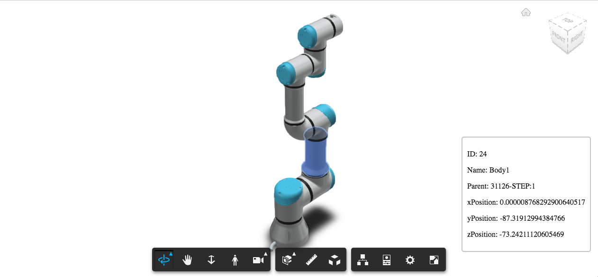
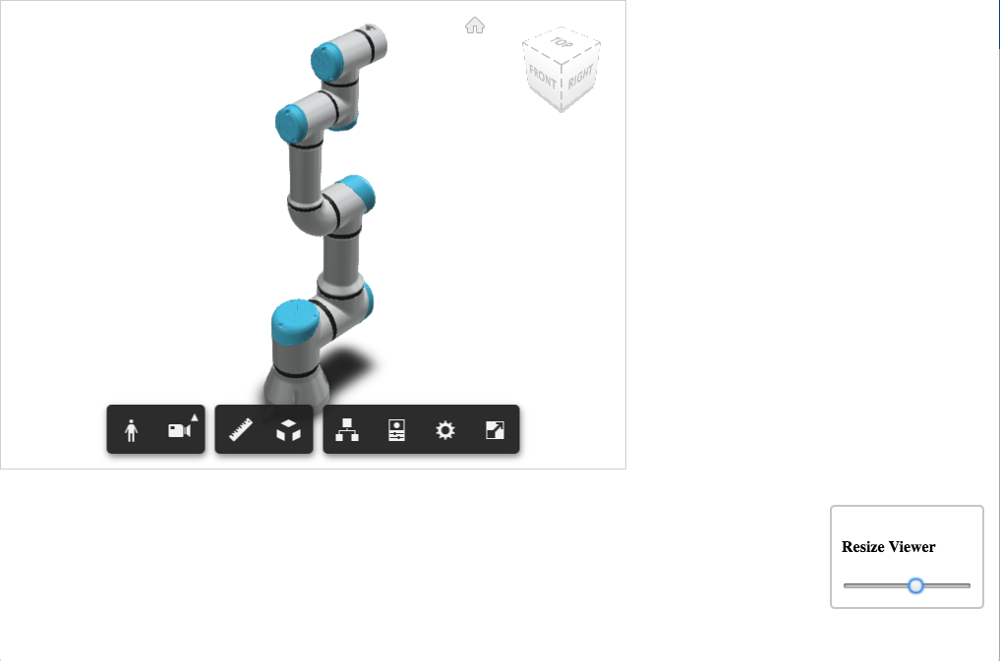
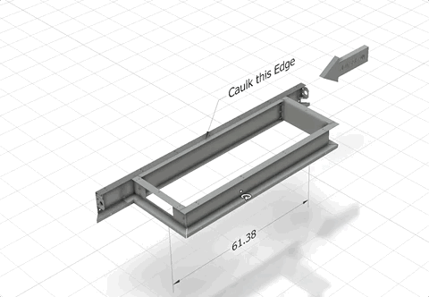

# ForgeViewerExtensions
Collection of self-contained Forge Viewer extensions:

[markupExtension](./assets/js/extensions/markupExt.js) - shows how to add 3d markups to a model.

[live here](https://apprentice3d.github.io/ForgeViewerExtensions/markerExt.html)

---------------------

[cameraRotationExtension](./assets/js/extensions/turnTableExt.js) - shows how to add a button to start and stop camera rotation around the model:

[live here](https://apprentice3d.github.io/ForgeViewerExtensions/cameraRotation.html)

---------------------

[transformationExplorerExtension](./assets/js/extensions/transformationExplorer.js) -
shows transformation data (position) of clicked component: 

[live here](https://apprentice3d.github.io/ForgeViewerExtensions/transformationExt.html)

---------------------

[viewerResizerExtension](./assets/js/extensions/viewerResizerExt.js) - illustrates how to resize 
dynamically the Forge Viewer window: 

[live here](https://apprentice3d.github.io/ForgeViewerExtensions/viewerResizerExt.html)

---------------------

[TransformTool](./assets/js/extensions/TransformTool.js) - illustrates how to attach a gizmo to a component and use it to move the component:

[live here](https://apprentice3d.github.io/ForgeViewerExtensions/translateExt.html)

